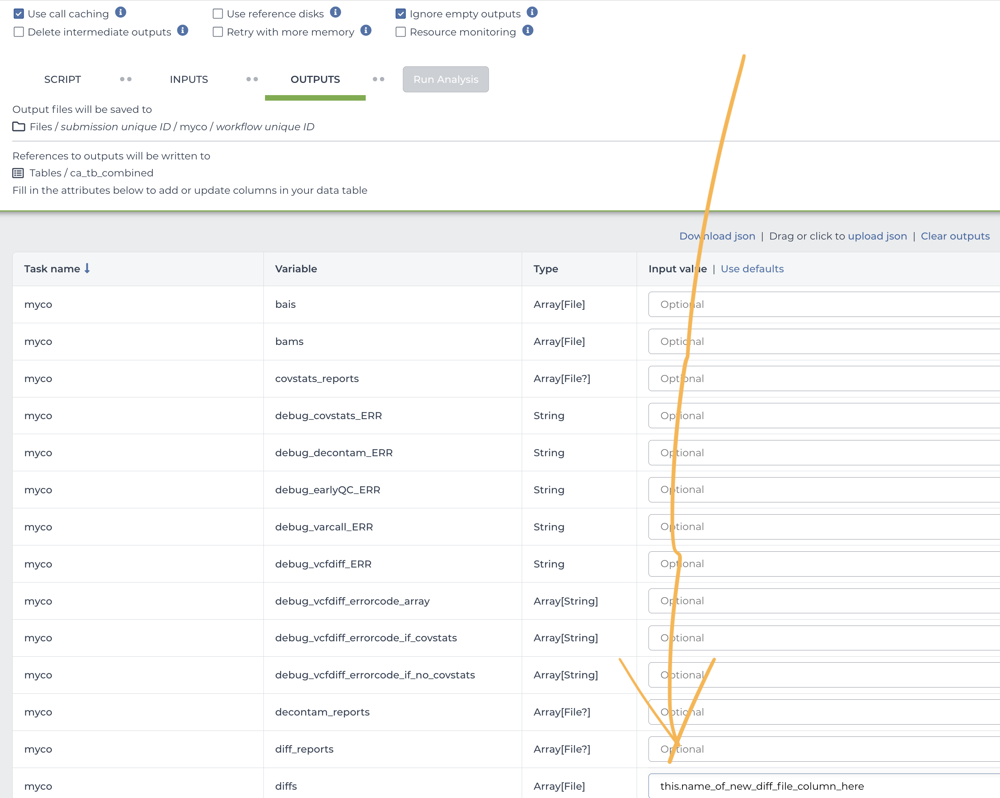

# How to Install and Run TB-D on Terra
*If you are not using the cloud compute platform Terra, please see [this documentation](./get_started_nonTerra.md) instead. If you are unsure if you want to use Terra, try TB-D without it first.*

> [!IMPORTANT]  
> This is an outdated version of TB-D that exists solely for reproducing published results. It is HIGHLY recommended you use a more recent version, because that has improved code and documentation.

This documentation assumes you are already familiar with the Terra system. Please see Terra's documentation for a detailed introduction if you are new to the system.

In brief:

1. Import the WDL workflow you want into a Terra workspace from Dockstore
2. Enter the gs:// URI of your BioSample text file as (TB-D_sra)

https://dockstore.org/workflows/github.com/aofarrel/myco/myco_raw:6.2.4?tab=versions

## Are you using Terra data tables?
If you are running on a Terra data table, and each row of your data table represents one sample, you should be aware that Terra will create an instance of TB-D_raw per sample. So if you're running on a 50 row table, you will be running 50 instances of TB-D, and if `tree_decoration` is `true`, you'll end up with 50 tiny little trees instead of one tree with 50 samples.

Fear not! TB-D is modular for precisely this reason. You will instead want to run [myco_raw](https://dockstore.org/workflows/github.com/aofarrel/myco/myco_raw:6.2.4?tab=versions) on your data table to generate diff files for every sample. Make sure sure to click the "Outputs" tab before submitting your workflow and set "diff" to save to your data table. The syntax is `this.whatever_you_want_to_call_the_new_column`, where `this` represents the data table you have selected. Be aware that you need to select a data table before you set any outputs.

Then, once your workflow has run, run Tree Nine on the "set" data table's diff column that you defined earlier. This will collate all of your samples into a single workflow run, placing all of your samples on a single tree.

If you are trying to reproduce our published results, you will want to use these versions:
* myco 6.2.4
* Tree Nine 0.0.16-REPRO

